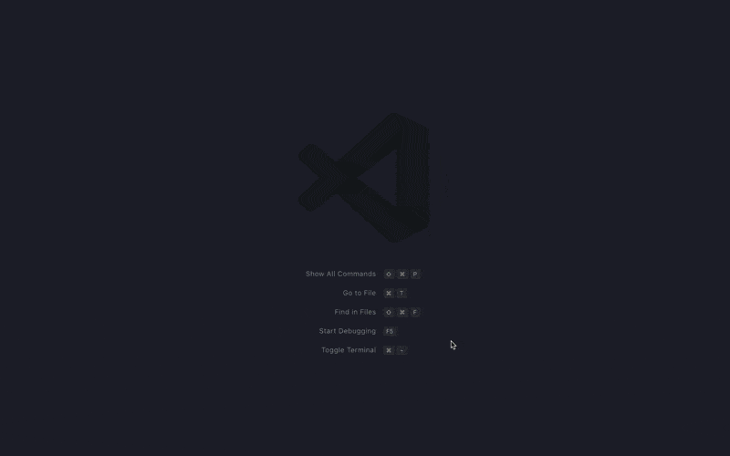

# My Scripts

Open up unsaved files prefilled by templates that you define. Works great with the [Code Runner](https://marketplace.visualstudio.com/items?itemName=formulahendry.code-runner) extension.

## Features
* Manage your scripts.
* Open up a script.

## Usages

* To confiure your scripts, choose `Open my scripts`
* Create a new file and save it.

* To use a script choose `Open new script`

## Change Log
See Change Log [here](CHANGELOG.md)

## Issues
Submit the [issues](https://github.com/laginha87/vscode-my-scripts/issues) if you find any bug or have any suggestion.

## Contribution
Fork the [repo](https://github.com/laginha87/vscode-my-scripts) and submit pull requests.